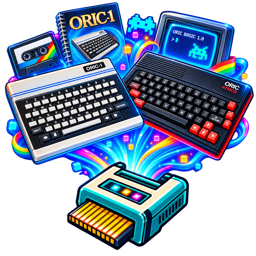

# Oric Emulator

A [SidecarTridge Multi-device](https://sidecartridge.com) microfirmware that
emulates an **Oric 1** and **Oric Atmos** computer on the Atari ST, STE, MegaST,
and MegaSTE. The project follows the standard SidecarTridge split between RP2040
firmware (`rp/`) and target-computer firmware (`target/atarist/`).

> Learn how to install and use it:
> <https://docs.sidecartridge.com/sidecartridge-multidevice/microfirmwares/oric-emulator/>

> 🛒 **Get the hardware:** [SidecarTridge Multi-device](https://sidecartridge.com/products/sidecartridge-multidevice-atari-st/)

This emulator is based on the [Reload Emulator](https://github.com/vsladkov/reload-emulator)
project by Veselin Sladkov. **Huge thanks** for his great work!

The floppy disk controller — WD1793 and Microdisc — is ported from
[Oricutron](https://github.com/pete-gordon/oricutron) by Peter Gordon and
contributors, used with his specific permission
([oricutron#216](https://github.com/pete-gordon/oricutron/issues/216)).
Thanks to Pete and the Oricutron team.

## ⚠️ Attention

This emulator is designed **only for low-resolution monitors**. It will **not**
work in high-resolution modes.

## 🚀 Installation

To install the Emulator app on your SidecarTridge Multi-device:

1. **Launch** the **Booster App** on your SidecarTridge.
2. Open the **Booster web interface** in your browser.
3. Go to the **Apps** tab and select **Oric Emulator** from the list.
4. Click **Download** to install the app to your SidecarTridge’s microSD card.
5. Once installed, select the app and click **Launch**.

After installation, the Oric Emulator will start automatically every time your Atari is powered on.

## 🕹️ Usage

### Setting up the microSD card

Everything lives in the `/oric` directory on the SidecarTridge microSD card.

**ROMs.** Copy one or more Oric ROM images there with a `.rom` extension — for
example `basic11b.rom`. They must be 16 KB. There are plenty of Oric ROM images
online; search for "orica.zip" or similar, or see the
[microfirmware documentation](https://docs.sidecartridge.com/sidecartridge-multidevice/microfirmwares/oric-emulator/).

**Tapes.** Copy `.tap` files to the same directory. Any filename works — you
pick them from a menu, so there is no naming convention to remember.

**Disks (optional).** To use disk images you need the Oric **Microdisc ROM**:
an 8 KB file, copied to the same directory under the exact name
`microdisc.rom`. It is deliberately not shown in the ROM menu — it is the disk
controller's EPROM, not a BASIC ROM. Then copy `.dsk` images alongside it. They
must be in the **MFM_DISK** format used by Oricutron and Euphoric (the common
format on oric.org); other `.dsk` flavours are refused with a message.

The emulated machine is an Atmos with a Microdisc, so the disk must carry a
Microdisc-bootable DOS — Sedoric, in practice. **Telestrat disks** (Stratsed;
oric.org often labels them `Telestrat`) boot only on a Telestrat, and the
Microdisc ROM answers them with `NO OPERATING SYSTEM`. Most titles exist in an
Atmos/Sedoric version as well — pick that one.

That is all the setup there is. Subdirectories, hidden files and system files
are ignored, so a card written from macOS or Windows will not show stray
entries.

### First run

On the first boot the emulator needs to know which ROM to use:

- If the card holds **exactly one** `.rom` file, it is installed automatically
  and the emulator starts.
- If it holds **several**, a list appears and you choose one.
- If it holds **none**, the screen tells you what to copy where.

Installing a ROM copies it into place and reboots the Multi-device, which takes
a couple of seconds. The choice is remembered, so later boots go straight to the
Oric.

### The menu

Press **F1** at any time to open the menu:

| Entry | What it does |
| --- | --- |
| **SELECT ROM** | Choose a different ROM and restart with it |
| **SELECT TAPE** | Insert a `.tap` into the virtual cassette drive |
| **EJECT TAPE** | Remove the current tape (shown only while one is inserted) |
| **SELECT DISK (EXPERIMENTAL)** | Insert a `.dsk` and boot it — the Oric resets with the Microdisc ROM active, the way a real one boots with a disk in the drive |
| **EJECT DISK (EXPERIMENTAL)** | Remove the current disk; the Oric keeps running (shown only while one is inserted) |
| **RESET ORIC** | A power cycle: memory is cleared, then the disk boots if one is inserted, otherwise BASIC starts fresh. (HELP is the soft reset that keeps memory.) |
| **STATUS** | Version, current ROM, tape and disk, and emulator timing |
| **HELP** | The keys and how to load a tape or change the ROM, on screen |
| **RETURN TO BOOSTER** | Leave the emulator and cold-boot the ST into the Booster app |
| **RESUME** | Back to the Oric |

Use the **arrow keys** to move, **Return** to choose, and **ESC** to go back a
level or close the menu. Lists longer than one page scroll with up/down, and
left/right jump a page at a time.

After inserting a tape, type `CLOAD""` at the Oric BASIC prompt to load it. A
green progress bar along the bottom of the screen shows how far through the tape
you are, and `TAPE FINISHED` appears briefly when it reaches the end — so you can
tell a load that is working from one that has stalled. You can find plenty of
Oric software online in places like [Oric.org](http://www.oric.org/).

### Other keys

| Key | Action |
| --- | --- |
| **F1** | Open the menu |
| **ESC** | Go back a level, or close the menu. With the menu closed it is the Oric's own ESC |
| **HELP** | Soft reset of the Oric (memory kept) |
| **UNDO** | Non-maskable interrupt (break) |
| **HOME** | Show screen-conversion timing without opening the menu |

Every other key goes to the Oric, including F2–F10. The Atari ST layout is
mapped to the Oric's keyboard, so a few symbols sit where the Oric expects
them rather than where the ST key cap says.

### ⏏️ Exiting to Booster

Choose **RETURN TO BOOSTER** from the menu. The screen goes black, the Atari ST
cold-boots, and the Booster app comes up. The old route still works too: power
cycle the Atari ST while holding the **SELECT** button on the SidecarTridge,
which interrupts the normal boot and launches the Booster app instead.

### 🔄 Power Cycling

After a power cycle, the emulator auto-launches.

## 🛠️ Under the hood

The Oric Emulator is built using the Reload Emulator core, adapted to run on the
SidecarTridge Multi-device platform.

## Repository layout

- `rp/` - RP2040-side firmware (hardware access, SD, UI/terminal, main loop).
- `target/atarist/` - Target-computer firmware built with `stcmd`. Produces a
  binary embedded into the RP firmware.
- `desc/` - App metadata template used by the build script.
- `dist/` - Build artifacts (UF2, JSON, md5sum).

### Submodules

This repository uses Git submodules for external SDKs:

- `pico-sdk/`
- `fatfs-sdk/`

## What’s next

Maintaining and improving this emulator is a hobby project for me. If you have
any suggestions or find any issues, please feel free to open an issue on the
GitHub repository.

### Missing features, future roadmap

Done since the first release:

- [x] TAP file load menu — tapes are chosen from an on-screen list instead of
  function keys.
- [x] Direct TAP file load — `.tap` files play as they are read, with no
  conversion step and nothing written to your card.
- [x] Faster framebuffer build — the Oric-to-Atari screen conversion is about
  30% cheaper per frame.
- [x] Better framebuffer — dropped frames and tearing are gone. One frame of
  latency remains and is inherent: the Atari has to copy the screen before it
  can show it.

Still open:

- [ ] Joystick/gamepad support.
- [x] Floppy disk support — a Microdisc with a WD1793, so standard `.dsk`
  images boot. One drive; the disk is read a track at a time from the card.
- [ ] Further performance improvements.

## License

This project is released under the GNU General Public License v3.0. See the [LICENSE](LICENSE) file for details.

Note: the original Reload Emulator repository does not display a license, so I
do not know what license to attribute for that upstream code.

The disk controller code in `rp/src/reload/devices/oric_microdisc.h` is ported
from Oricutron, which is GPL version 2 only. It is used here under a specific
permission from its author, Peter Gordon
([oricutron#216](https://github.com/pete-gordon/oricutron/issues/216)); his
copyright notice and the list of contributors are kept in that file.
